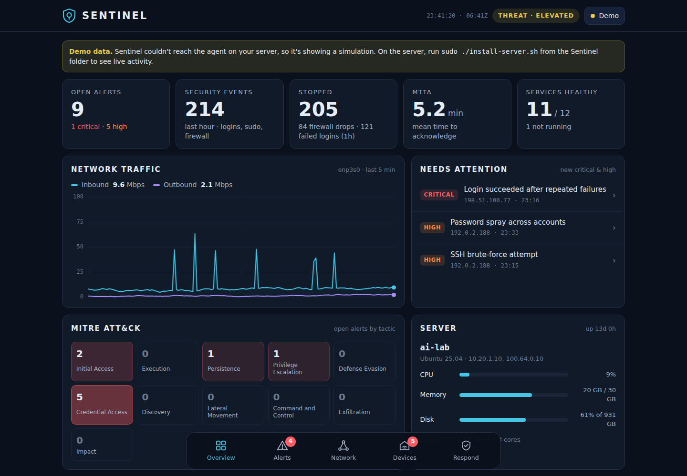
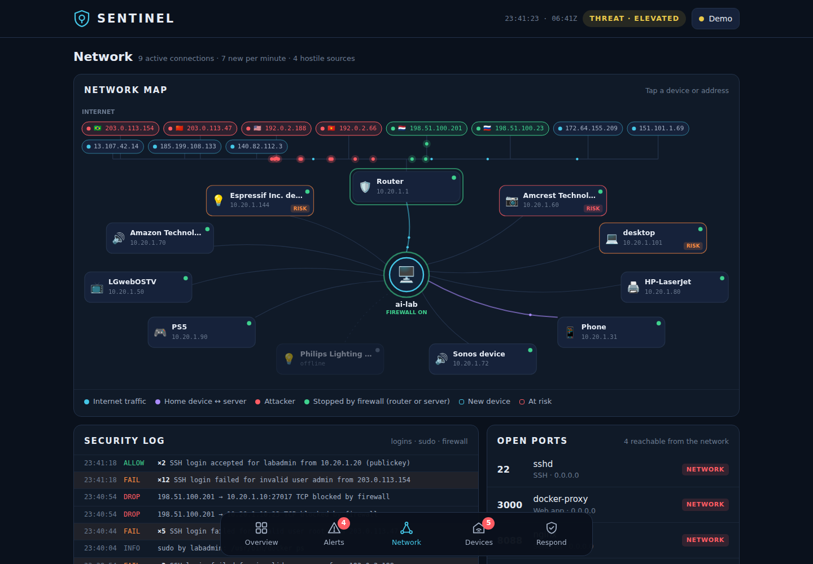
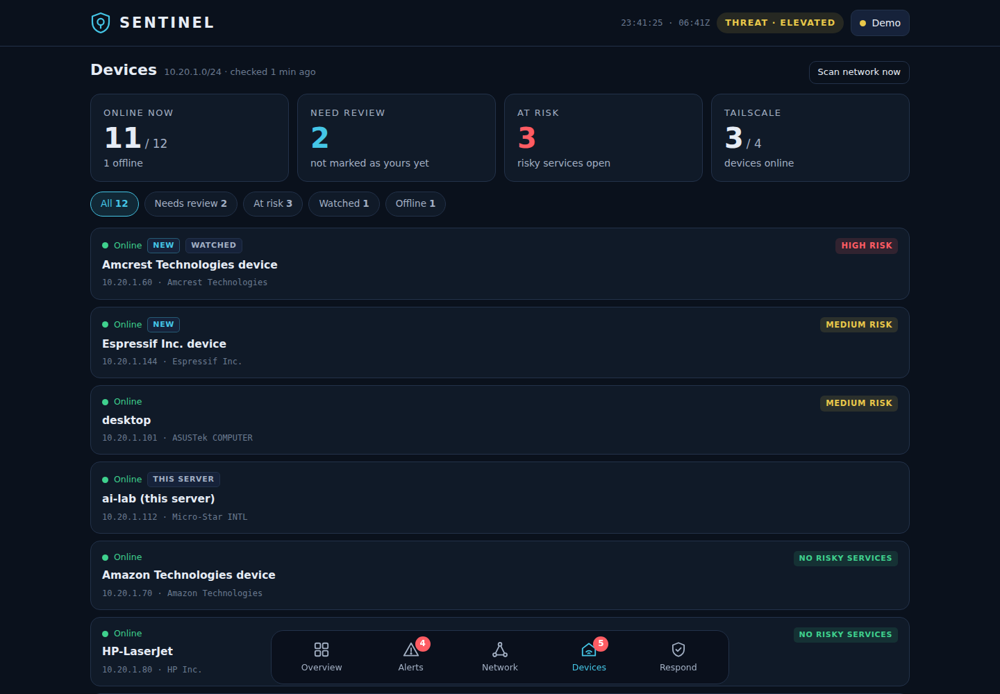
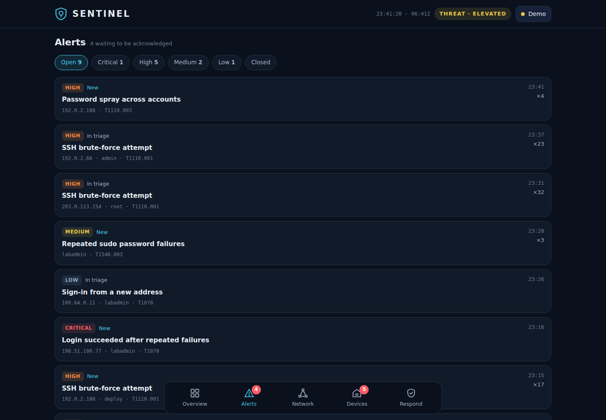
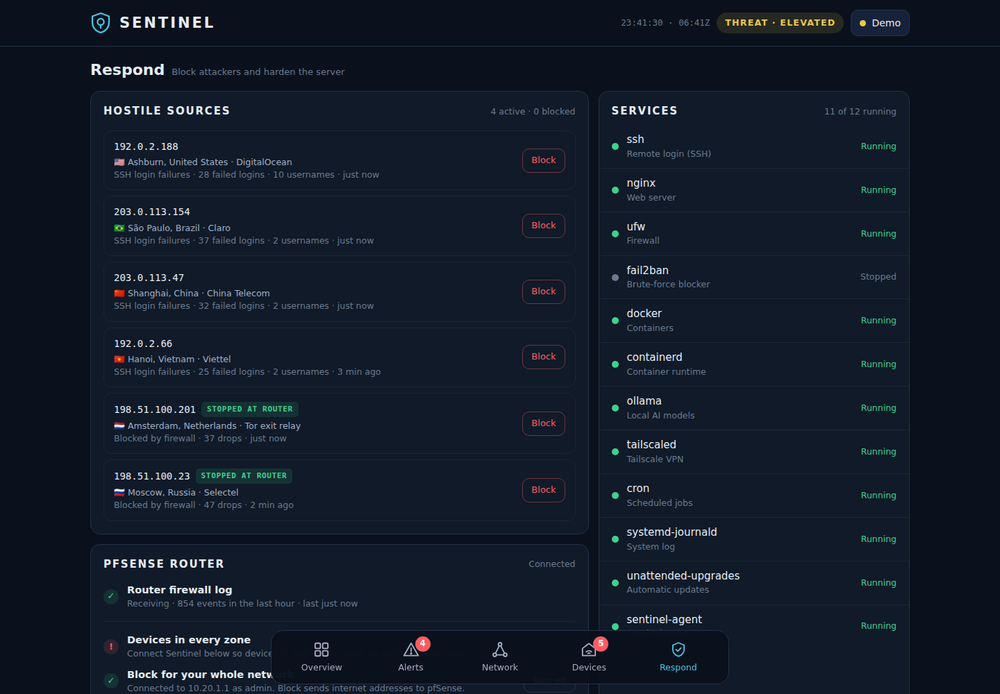
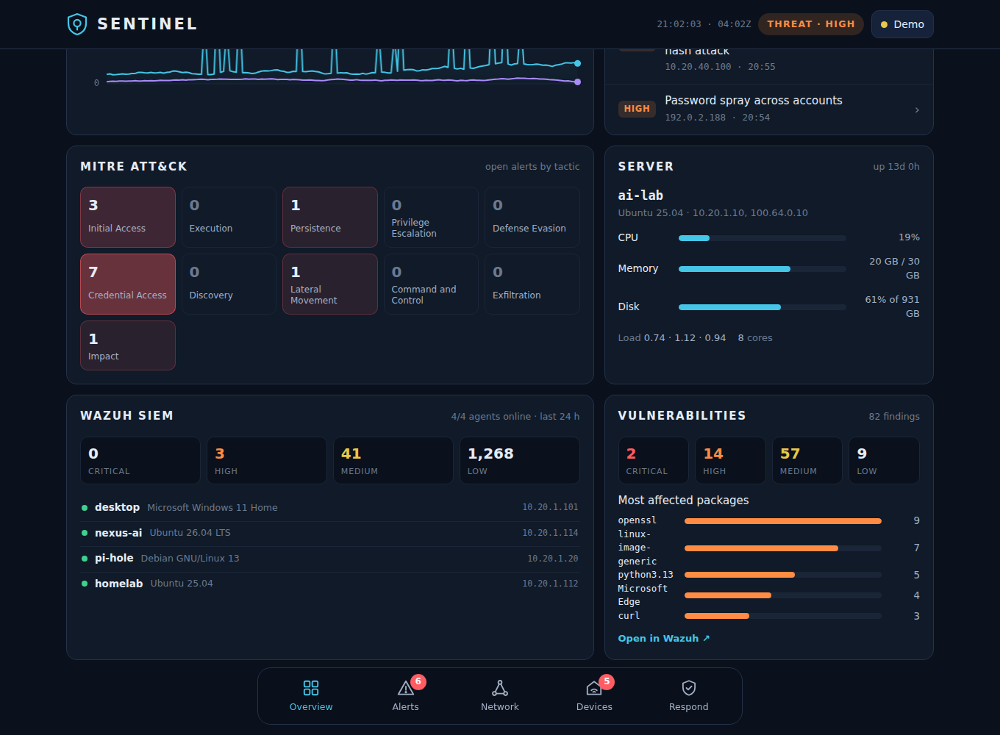
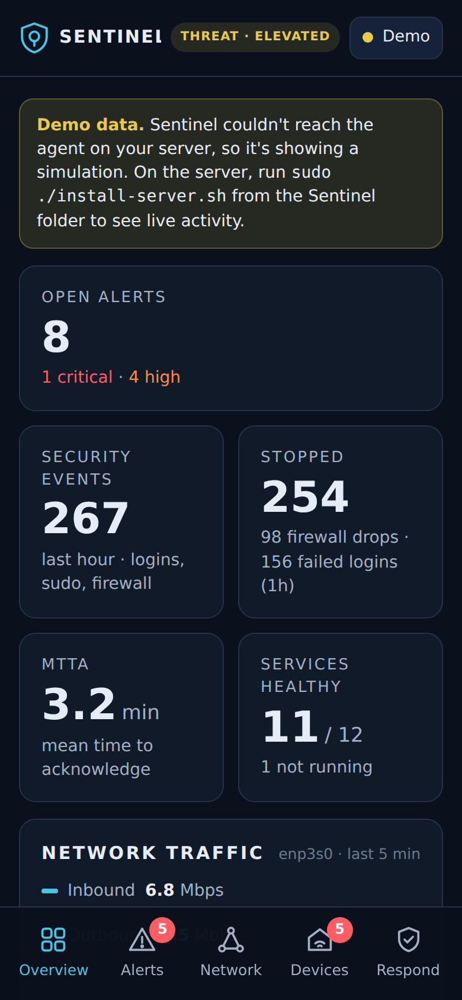

# Homelab SOC Dashboard

[](https://github.com/KevinTechLabs/Homelab-Soc-Dashboard/actions/workflows/ci.yml) [](LICENSE)

A self-hosted **security operations center (SOC) dashboard and network threat monitor** for a home lab. The dashboard is called **Sentinel**. It runs on an Ubuntu server, watches the server and the whole home network in real time, maps detections to **MITRE ATT&CK**, pulls in **pfSense** firewall logs, and sends alerts to **Discord**.



> Screenshots show the built-in demo mode with example data. No real addresses or hosts are shown.

## Highlights

- **Live detection engine** in plain Python 3 (standard library only). It reads the systemd journal, `/proc`, ufw and socket tables, with no agents to install on other machines.
- **MITRE ATT&CK mapping** for every alert, plus an ATT&CK tactic heat map on the dashboard.
- **pfSense integration:** router firewall logs over syslog, device discovery in every VLAN from DHCP events, and optional network-wide blocking through pfSense `easyrule`.
- **Network visibility:** device discovery (arp-scan, ping, pfSense DHCP), vendor lookup, risky-port checks per device, ARP-spoofing detection, and the Tailscale device list.
- **Private-address aware:** phones that rotate their private Wi-Fi address come back looking like new devices. Sentinel suggests merging them with the device you already named, but only if both addresses are private, they share a network name and zone, and they were never online at the same time. Nothing merges until you confirm. A two-tap button removes every offline device you haven't marked as yours.
- **Response actions:** block and unblock attackers (ufw on the server, or pfSense for the whole network), optional auto-block, alert acknowledge, escalate and close, and a one-click clear of the hostile-sources list (blocked addresses stay).
- **Wazuh SIEM integration:** pulls Wazuh alerts (rule, agent, MITRE mapping, deep link), agent health and vulnerability counts through Wazuh's indexer and server APIs, using read-only accounts and certificate pinning. Alerts when a watched device's agent stops reporting (T1562.001); agents on machines you switch off just log a line.
- **Discord notifications:** rate-limited alerts for high and critical events, plus a daily summary in your time zone.
- **Alerts from other systems:** Prometheus Alertmanager and GitOps deploy agents can push alerts in. They land in the same inbox with the same acknowledge / escalate / close flow, close themselves when the source reports them resolved, and go to the same Discord channel. A heartbeat watchdog warns you when a monitored machine goes silent.
- **Runs anywhere you look:** a responsive web app (installable on phone and PC), a Windows app-window launcher, and an optional Electron desktop build.
- **Secure by default:** the API listens on localhost behind nginx, actions need an access key, and the webhook is never sent to the browser.

## Screenshots

| Network map | Devices |
|---|---|
|  |  |

| Alerts | Respond |
|---|---|
|  |  |



<p align="center"></p>

## Architecture

```text
 Phone / PC browser ──HTTP──► nginx :8088 ──/api/──► sentinel_agent.py (127.0.0.1:8765)
                               │  static dashboard        │
                               └─ web/index.html          ├─ journalctl (sshd, sudo, su, kernel/ufw)
                                                          ├─ /proc (CPU, memory, disk, sockets, traffic)
                                                          ├─ systemctl, ufw, sshd settings
                                                          ├─ arp-scan / ping sweep, port checks
                                                          ├─ tailscale status --json
                                                          ├─ UDP 5140 ◄── pfSense syslog (firewall + DHCP)
                                                          ├─ HTTPS (pinned) ──► Wazuh indexer :9200 + API :55000 (read-only, optional)
                                                          ├─ SSH ──► pfSense easyrule (optional)
                                                          └─ HTTPS ──► Discord webhook, ip-api.com (geo)
```

State lives in `/var/lib/sentinel/state.json`, the access key in `/etc/sentinel/token`, and the ingest-only key in `/etc/sentinel/ingest_token`.

## Detections

| Detection | Severity | ATT&CK technique | Tactic |
|---|---|---|---|
| SSH brute-force attempt | high / critical | T1110.001 | Credential Access |
| Password spray across accounts | high | T1110.003 | Credential Access |
| Login succeeded after repeated failures | critical | T1078 | Initial Access |
| Direct root login over SSH | high | T1078.003 | Initial Access |
| Sign-in from a new address | low / medium | T1078 | Initial Access |
| Repeated sudo password failures | medium | T1548.003 | Privilege Escalation |
| Port scan (server firewall) | medium | T1046 | Discovery |
| Port scan stopped at the router (pfSense) | low | T1046 | Discovery |
| New service listening on the network | medium | T1543 | Persistence |
| Service stopped or failed | medium / high | T1489 | Impact |
| Sustained high CPU | low | T1496 | Impact |
| Disk almost full | medium | T1499 | Impact |
| New device joined the network | medium | T1200 | Initial Access |
| Router hardware address changed (ARP spoofing) | critical | T1557.002 | Credential Access |
| Risky service on a device (Telnet, TR-069, FTP, VNC, RDP, ADB, ...) | high / medium | T1021, T1133 | Lateral Movement / Initial Access |
| New device joined the Tailscale network | high | T1078 | Initial Access |
| Watched device went offline | medium | — | Impact |
| Wazuh agent stopped reporting | medium | T1562.001 | Defense Evasion |
| pfSense logs stopped arriving (30 min of silence; closes itself when logs resume) | high | T1562.006 | Defense Evasion |
| Any Wazuh alert level 7+ (Sysmon, auth, FIM, vulnerability, ...) | mapped from Wazuh level | from the Wazuh rule | from the Wazuh rule |

Noise control: repeated events are grouped per source and hour. Router log lines are rolled up per attacker every 5 minutes. Late reply packets (TCP without SYN, UDP from DNS/QUIC/NTP servers) and one-off drops aren't counted as hostile sources.

## Install (Ubuntu Server)

```bash
git clone https://github.com/KevinTechLabs/Homelab-Soc-Dashboard.git
cd Homelab-Soc-Dashboard
sudo ./install-server.sh 8088
```

The installer:
- installs nginx, python3 and arp-scan if needed
- sets up the `sentinel-agent` systemd service
- configures nginx on the chosen port
- opens that port in ufw
- allows the router to send logs to UDP 5140
- prints the dashboard address and your **access key**

Open `http://SERVER-IP:8088` from your PC or phone. Managing alerts (acknowledge, escalate, close) needs no key. Actions that change something, like blocking an address, notifications or the pfSense link, ask for the access key once per browser; to see it again, run `sudo cat /etc/sentinel/token`.

Re-run the installer to update. To remove Sentinel, run `sudo ./install-server.sh --uninstall`.

> Keep the dashboard on your home network or behind a VPN such as Tailscale. Don't port-forward it.

### Network zones (optional)

If your network uses VLANs, give each subnet a friendly name. The Devices tab and network map show these labels:

```bash
sudo cp examples/zones.example.json /etc/sentinel/zones.json   # then edit it with your subnets
sudo systemctl restart sentinel-agent
```

## Wazuh SIEM (optional)

If Wazuh runs on the same server, Sentinel shows its alerts, agents and vulnerabilities alongside its own detections. Create two **read-only** accounts in Wazuh:

1. **Indexer management → Security → Internal users:** create `sentinel`, then map it to the `readall` role.
2. **Server management → Security → Users:** create `sentinel-api` with the `readonly` role.
3. On the server:
   ```bash
   sudo python3 /opt/sentinel/sentinel_agent.py --wazuh-setup   # prompts for both passwords (hidden)
   sudo systemctl restart sentinel-agent
   ```

Design notes:
- Credentials live only in `/etc/sentinel/wazuh.json` (mode 600) and never reach the browser.
- Wazuh uses self-signed certificates, so the setup records each certificate's SHA-256 fingerprint and every request is checked against it (trust on first use). A changed certificate stops the integration instead of silently trusting it.
- Alerts are read incrementally with a persisted cursor and de-duplicated by document ID, then grouped per rule, agent and hour so a noisy rule becomes one alert with a count.
- Both accounts are read-only: Sentinel can see Wazuh but can't change it.

## Discord alerts

In the dashboard, go to **Respond → Discord notifications**:
1. In Discord, open **Server Settings → Integrations → Webhooks → New Webhook**, pick the channel, and copy the URL.
2. Paste it into the dashboard and tap **Connect**. The webhook is verified with Discord before it's saved.
3. Choose **high and critical** or **critical only**, and optionally turn on the **daily summary** at a time of your choice.

At most 6 alert messages post per 5 minutes. When more fire in that time, the next message says how many were held back. The webhook is stored only on the server.

## Alerts from Prometheus and deploy pipelines

Sentinel can be the one inbox for your whole lab, not just security. Two
endpoints accept alerts from other systems. Give those systems the **ingest
key** (`sudo cat /etc/sentinel/ingest_token`), not your access key: it works
only on `/api/ingest/*`, so a copy on another machine can't block addresses,
change notifications or touch the router. Send it as
`Authorization: Bearer <key>` (or `X-Sentinel-Key`).

**Prometheus Alertmanager:** point a webhook receiver at Sentinel:

```yaml
receivers:
  - name: sentinel
    webhook_configs:
      - url: http://SENTINEL-IP:8088/api/ingest/alertmanager
        send_resolved: true
        http_config:
          authorization:
            type: Bearer
            credentials_file: /etc/alertmanager/secrets/sentinel_key   # the ingest key
```

- Each firing alert becomes a Sentinel alert, titled `AlertName (env)`, with
  the rule's `summary` as the detail. Severity comes from the `severity`
  label: `critical` → critical, `page` → high, `warn` → medium, anything
  else → low. Add `mitre_technique` / `mitre_tactic` labels to a rule to map
  it to ATT&CK; otherwise it's filed under Impact.
- Repeat notifications update the same alert. When Alertmanager sends
  *resolved*, the alert closes itself and Discord gets a short **RESOLVED**
  message (only for alerts that were sent to Discord in the first place).
  If it fires again later, that's a new alert.
- **Dead man's switch:** an always-firing alert named `Watchdog` is treated
  as a heartbeat, not an alert. If a machine that has sent one goes quiet for
  5 minutes (`SENTINEL_WATCHDOG_SILENT_MIN`), Sentinel raises *Monitoring on
  &lt;host&gt; stopped reporting* (T1562.006) and closes it when the heartbeat
  returns. This works best when Sentinel runs on a different machine from
  the one it's watching.

**One-off events** (for example a deploy agent):

```bash
curl -fsS -X POST http://SENTINEL-IP:8088/api/ingest/event \
  -H "Authorization: Bearer $INGEST_KEY" -H 'Content-Type: application/json' \
  -d '{"source":"ai-lab","kind":"GitOps","level":"high","title":"staging rolled back",
       "text":"65cda30 failed its post-deploy checks","key":"rollback:staging:65cda30"}'
```

`level` is `info` (activity feed only) or `low` / `medium` / `high` /
`critical` (raises an alert; same `key` = same alert). Optional `technique` and
`tactic` set the ATT&CK mapping.

Ingested alerts show a **Prometheus**, **GitOps** or **Watchdog** tag in the
Alerts tab, and `/api/state` lists every source under `integrations`. Tests:
`python3 -m unittest discover -s tests`.

## pfSense integration

**Firewall and DHCP logs (recommended):** in pfSense, go to **Status → System Logs → Settings → Remote Logging**. Set the remote server to `SERVER-IP:5140` and tick **Firewall Events** and **DHCP Events**. You get:
- everything the router blocks, rolled up per attacker
- port scans stopped at the router
- attackers shown in green on the map
- devices from **every VLAN**, labeled with their zone

**Network-wide blocking and the full device list (optional):** turn on SSH in pfSense with **Public Key Only**, then paste the dashboard's public key into **System → User Manager → admin → Authorized SSH Keys**. You get two things:
- **Block** on an internet address runs `easyrule block wan <address>`, protecting every device.
- Every 5 minutes Sentinel reads pfSense's ARP table and DHCP leases, so devices in **every zone** show their real online status, including devices with fixed addresses.

This gives the server the ability to change your router's firewall, so skip it if that trade-off isn't right for you.

### Troubleshooting

| Symptom | Cause and fix |
|---|---|
| Devices in other zones show **offline** while they're actually online | Without the SSH device list, Sentinel only learns about other zones from DHCP log events and marks a device offline 3 hours after the last one. Connect the device list (above). If the Respond tab says the router firewall log stopped, see the next row. |
| **Router firewall log** stopped updating (Sentinel raises **"pfSense logs stopped arriving"** after 30 minutes) | Check that packets arrive with `sudo tcpdump -ni <iface> udp port 5140`. If nothing arrives, pfSense stopped sending: untick and re-tick **Enable Remote Logging** and save, which restarts its syslog daemon. In my lab this happened twice with **Source Address** set to **LAN**. Switching it to **Default (any)** is the fix being tested. |
| A phone shows up as a **new device** every time it rejoins | iOS/Android "rotating" private Wi-Fi addresses. Open the new device: Sentinel offers **Same device: merge** when it matches one you already named. Setting the phone's private address to **Fixed** for your home network stops it. |
| Only some devices have a **glowing line** on the network map | By design. A glowing line means a live connection to the server right now (Pi-hole glows because the server uses it for DNS), not that the device is online. The green dot shows online status. |

## Other ways to open the dashboard

- **Windows app window:** run `Install Shortcuts.bat` for Desktop and Start-menu shortcuts that open the dashboard in its own Edge app window.
- **Desktop app (Electron):** `npm install`, then `npm start`, or `npm run build:win` for an installer and portable `.exe`.
- **Installable web app:** the `web/` folder has a manifest, icons and a service worker. Host it over HTTPS to install it on a phone or PC.

If the dashboard can't reach the agent, it runs in **demo mode** with simulated data and says so in a banner.

## Project layout

| Path | Purpose |
|---|---|
| `agent/sentinel_agent.py` | Detection engine and JSON API (Python 3, standard library only) |
| `web/index.html` | The whole dashboard (single file, no build step) |
| `web/manifest.webmanifest`, `web/sw.js`, `web/icons/` | Installable web-app support |
| `install-server.sh` | Ubuntu installer and updater (nginx + systemd) |
| `tests/` | Tests for the ingest endpoints and the agent's parsing helpers (`python3 -m unittest discover -s tests`) |
| `examples/zones.example.json` | Example VLAN zone names |
| `main.js`, `package.json` | Optional Electron desktop shell |
| `Start Sentinel.bat`, `Install Shortcuts.bat` | Windows app-window launcher |

## Tech

Python 3 (stdlib `http.server`, `subprocess`, `socket`), vanilla JavaScript and Canvas (no framework), nginx, systemd, ufw, journald, pfSense syslog/easyrule, the Discord webhook API, the Wazuh indexer and server REST APIs, the Prometheus Alertmanager webhook format, and the Tailscale CLI.

## Related

[Personal-CI-CD](https://github.com/KevinTechLabs/Personal-CI-CD) sends its Prometheus alerts and deploy events here.

The home-lab network this dashboard monitors, including VLAN zones, pfSense rules, Suricata, pfBlockerNG and Pi-hole, is documented in [Desk-Pi-Rack](https://github.com/KevinTechLabs/Desk-Pi-Rack).

## License

[MIT](LICENSE)
